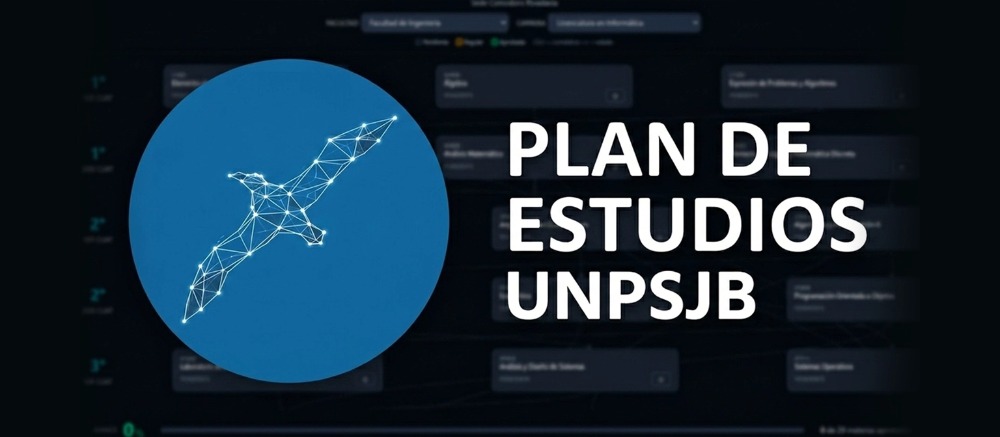
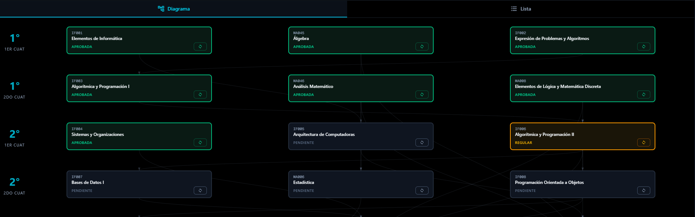
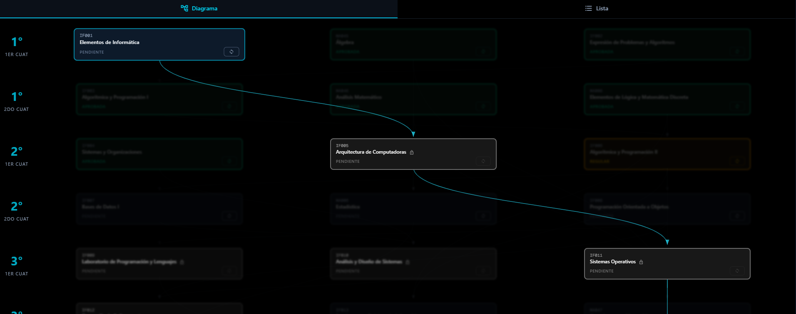

<div align="center">




Visualizá tu avance académico, marcá el estado de tus materias y explorá correlativas — todo desde el navegador, sin cuenta ni registro.

[](https://github.com/AxelRojas-hub/plan-estudios-unpsjb/commits/main)
[](https://github.com/AxelRojas-hub/plan-estudios-unpsjb/graphs/contributors)
[](https://nextjs.org)
[](https://www.typescriptlang.org)
[](https://tailwindcss.com)
[](https://web.dev/progressive-web-apps/)

</div>

## Funcionalidades

- **Vista diagrama** — plan de estudios organizado por año y cuatrimestre
- **Vista lista** — tabla compacta con todas las materias y su estado
- **Estados de materia** — marcá cada materia como Pendiente, En Curso, Regular o Aprobada
- **Correlativas interactivas** — al seleccionar una materia se resaltan sus correlativas
- **Progreso persistente** — el avance se guarda en el navegador
- **Múltiples carreras** — incluye 5 facultades con sus respectivas carreras
- **Instalable como PWA** — funciona offline una vez instalado


## Capturas

### Vista general del diagrama



### Correlativas resaltadas



## Inicio Rápido

```bash
# 1. Cloná el repositorio
git clone https://github.com/AxelRojas-hub/plan-estudios-unpsjb.git
cd plan-estudios-unpsjb

# 2. Instalá las dependencias
pnpm install

# 3. Iniciá el servidor de desarrollo
pnpm run dev
```

La app estará disponible en [http://localhost:3000](http://localhost:3000).


## 🛠️ Stack tecnológico

| Tecnología | Uso |
|---|---|
| [Next.js 16](https://nextjs.org) | Framework React con App Router |
| [React 19](https://react.dev) | UI |
| [TypeScript 5](https://www.typescriptlang.org) | Tipado estricto de datos |
| [TailwindCSS 4](https://tailwindcss.com) | Estilos utilitarios |
| [Material UI 7](https://mui.com) | Componentes de interfaz |
| [next-pwa](https://github.com/DuCanhGH/next-pwa) | Soporte PWA |


## 🤝 Contribuir o adaptar el proyecto

¿Querés reportar un bug, proponer una mejora o adaptar la app para tu institución?

Consultá la [**Guía de Contribución**](CONTRIBUTING.md) donde encontrarás:
- Pasos para personalizar con tus propios planes de estudio
- Documentación de los tipos de datos TypeScript
- Cómo abrir issues y pull requests

##  Colaboradores

<a href="https://github.com/AxelRojas-hub/plan-estudios-unpsjb/graphs/contributors">
  
</a>
